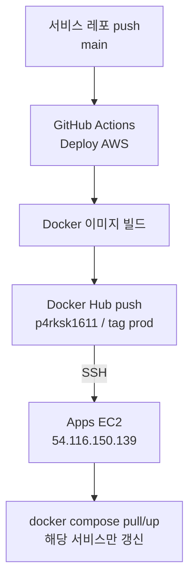
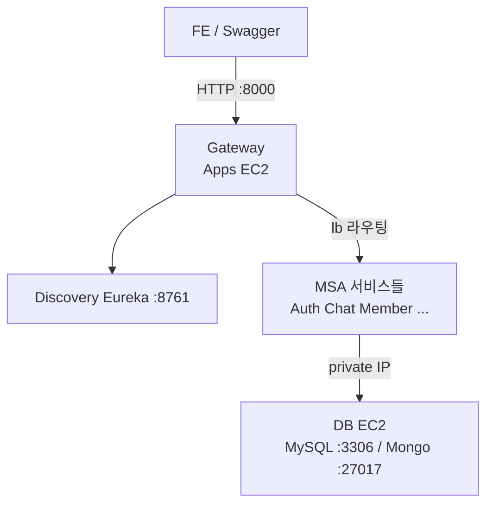
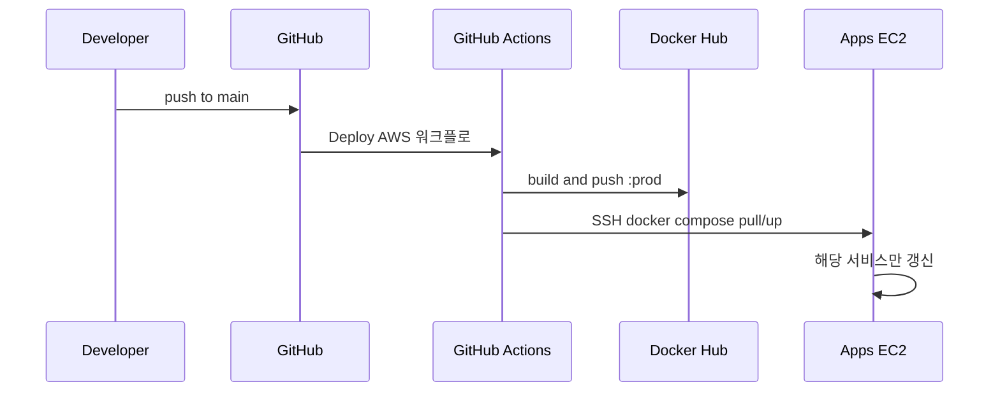

# ValueHub Prod CI/CD

서비스 레포 **`main` 또는 `develop` 푸시** → GitHub Actions → Docker Hub 이미지 빌드/푸시 → **Apps EC2**에 자동 배포.

Gateway 통합 Swagger로 Auth/Chat 등 API 실검증까지 완료.

---

## 아키텍처

| 구분 | 역할 | 인스턴스 | 스펙 | Elastic IP |
| --- | --- | --- | --- | --- |
| **Apps EC2** | Eureka, Gateway, 전 MSA, Redis, Kafka | `i-0cc2c7df37a02b606` | t3.large | `54.116.150.139` |
| **DB EC2** | MySQL + MongoDB (단일 노드 RS) | `i-00753b29433e6351c` | t3.medium | `52.78.72.232` |

- 리전: `ap-northeast-2` (서울)
- AWS 계정/프로필: `valuehub` / `471112928396`
- 키페어: `valuehub-aws-prod`
- PEM(로컬): `ValueHub-AWS-Infra/.valuehub-aws-prod.pem`
- Apps SG: `sg-095cc58b5a43c744b`
- DB SG: `sg-023aefc5e5868a2f5`

### 배포 흐름 (CI/CD 전용)

### API 요청 흐름 (런타임 전용)

이미 배포된 뒤, FE/클라이언트가 API를 칠 때의 경로만 본다. 배포 파이프라인은 포함하지 않는다.

---

## 인프라 레포

| 항목 | 값 |
| --- | --- |
| 레포 | `SpartaValueHub/ValueHub-AWS-Infra` |
| Apps compose | `compose.prod-apps.yml` |
| DB compose | `compose.prod-db.yml` |
| 원격 경로 | `/opt/valuehub-aws-infra` |
| Infra 워크플로 | `Deploy Apps (Prod)` — `compose.prod-apps.yml` scp → EC2 전체 `compose up` |
| 서비스 CD 템플릿 | `templates/deploy-aws.yml` |

> 템플릿은 복붙용 원본이다. 실제 트리거는 **각 서비스 레포**의 `.github/workflows/deploy-aws.yml`이 담당한다.  
> Infra 템플릿만 고쳐도 서비스에 자동 반영되지 않는다.

### 두 배포 경로 (역할 분리)

| 경로 | 트리거 | 하는 일 | 안 하는 일 |
| --- | --- | --- | --- |
| **서비스 CD** (`deploy-aws.yml`) | 서비스 레포 `main`/`develop` | 해당 서비스 이미지만 pull/up | compose 파일 동기화 안 함 |
| **Infra Deploy Apps** (`deploy-apps.yml`) | Infra `main` + `compose.prod-apps.yml` / `env/**` / `scripts/**` 변경 | compose를 EC2에 scp 후 전체 up | `.env` 실값·시크릿 수정 안 함 |

미디어(`x-media-env` → `S3_BUCKET` 등)는 **compose 정의는 Infra Deploy Apps**로 자동 반영되고, **실값은 Apps EC2 `.env`**에만 둔다.

---

## CI/CD 동작

1. 서비스 레포 `main` 푸쉬
2. `Deploy AWS` 워크플로 실행  
   (`on.push.branches: [main, develop]`)
3. Docker 이미지 빌드 → Docker Hub 푸시  
   - 계정: `p4rksk1611`  
   - 태그: `IMAGE_TAG=prod` (+ git sha 태그)
4. Apps EC2 SSH → `docker compose pull/up` 해당 서비스만 갱신  
   - 경로: `/opt/valuehub-aws-infra`  
   - compose가 EC2의 `.env`를 읽어 런타임 주입 (값은 배포가 수정하지 않음)
   - DB EC2는 이 단계에서 배포 대상이 아님 (이미 떠 있는 DB에 Apps가 접속)

### 트리거 브랜치

| 브랜치 | 푸시 시 배포 |
| --- | --- |
| `main` | O  |

`develop → main` 머지 시 워크플로 파일도 함께 올라가면 main 쪽 정의가 맞춰진다.

### 레포별 시크릿 / 변수

**Secrets**

| Name | Value |
| --- | --- |
| `APPS_EC2_HOST` | `54.116.150.139` |
| `APPS_EC2_USER` | `ubuntu` |
| `APPS_EC2_SSH_KEY` | PEM |
| `DOCKERHUB_USERNAME` | `p4rksk1611` |
| `DOCKERHUB_TOKEN` | Docker Hub Access Token |

**Variables**

| Name | Value |
| --- | --- |
| `IMAGE_NAME` | `p4rksk1611/valuehub-<서비스>` |
| `COMPOSE_SERVICE` | compose 서비스명 (예: `auth`, `gateway`) |
| `IMAGE_TAG` | `prod` |

### 배포된 서비스 레포 (14개)

Auth / Chat / Gateway / Discovery / Member / Category / Product-Post(listing) / Member-Regions / Reports / Reservations / Reviews / Notifications / Premium-Plans / Bo

> 노트북용 레거시 `deploy.yml`은 Gateway/Discovery에서 `main` 비활성 처리함.

---

## 접속 / 테스트

| 용도 | URL |
| --- | --- |
| Gateway Health | http://54.116.150.139:8000/health |
| 통합 Swagger | http://54.116.150.139:8000/swagger-ui/index.html |
| Eureka | http://54.116.150.139:8761 |

Gateway 프록시 예:
- `/auth-service/api/v1/auth/sign-in`
- `/chat-service/api/v1/chat/rooms`

---

## `.env`와의 관계

- 실값 `.env`는 Apps EC2 `/opt/valuehub-aws-infra/.env` (git 비포함)
- 서비스 CD는 **이미지·컨테이너만** 갱신하고 `.env` / compose 파일을 건드리지 않음
- Infra Deploy Apps는 **compose만** EC2에 덮어쓰고, `.env`는 그대로 둠
- `.env` 값 변경은 EC2에서 수동 수정 후 해당 서비스 `compose up -d` 재기동
- 미디어: [media-s3-cloudfront.md](./media-s3-cloudfront.md), API 규약: [media-api-spec.md](./media-api-spec.md)

자세한 흐름: [env-flow.md](./env-flow.md)
Kafka 토픽·페이로드: [kafka.md](./kafka.md)
