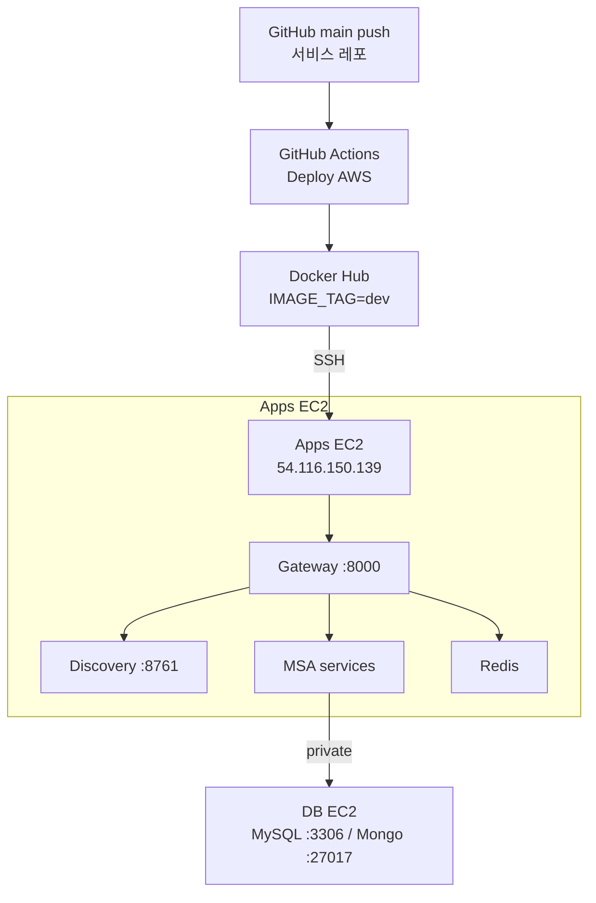
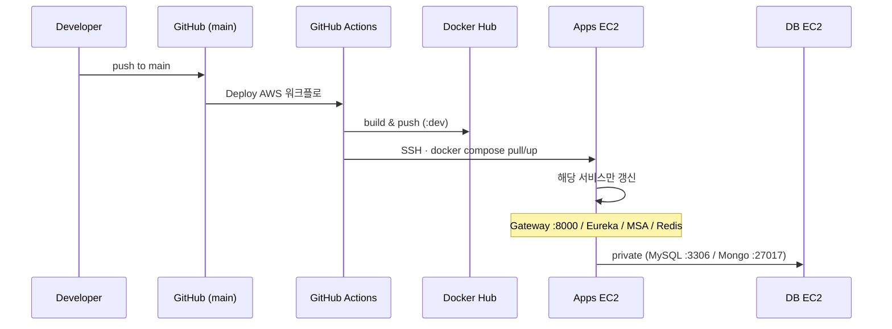

# ValueHub Prod CI/CD

`main` 푸시 → GitHub Actions → Docker Hub 이미지 빌드/푸시 → **Apps EC2**에 자동 배포.

Gateway 통합 Swagger로 Auth/Chat 등 API 실검증까지 완료.

---

## 아키텍처

| 구분 | 역할 | 인스턴스 | 스펙 | Elastic IP |
| --- | --- | --- | --- | --- |
| **Apps EC2** | Eureka, Gateway, 전 MSA, Redis | `i-0cc2c7df37a02b606` | t3.large | `54.116.150.139` |
| **DB EC2** | MySQL + MongoDB (단일 노드 RS) | `i-00753b29433e6351c` | t3.medium | `52.78.72.232` |

- 리전: `ap-northeast-2` (서울)
- AWS 계정/프로필: `valuehub` / `471112928396`
- 키페어: `valuehub-aws-prod`
- PEM(로컬): `ValueHub-AWS-Infra/.valuehub-aws-prod.pem`
- Apps SG: `sg-095cc58b5a43c744b`
- DB SG: `sg-023aefc5e5868a2f5`

---

## 인프라 레포

| 항목 | 값 |
| --- | --- |
| 레포 | `SpartaValueHub/ValueHub-AWS-Infra` |
| Apps compose | `compose.prod-apps.yml` |
| DB compose | `compose.prod-db.yml` |
| 원격 경로 | `/opt/valuehub-aws-infra` |
| Infra 워크플로 | `Deploy Apps (Prod)` (compose scp + `docker compose up`) |
| 서비스 CD 템플릿 | `templates/deploy-aws.yml` |

---

## CI/CD 동작

1. 서비스 레포 **`main`** 푸시
2. `Deploy AWS` 워크플로 실행
3. Docker 이미지 빌드 → Docker Hub 푸시 (`IMAGE_TAG=dev`)
4. Apps EC2 SSH → `docker compose pull/up` 해당 서비스만 갱신

### 레포별 시크릿 / 변수

**Secrets**

| Name | Value |
| --- | --- |
| `APPS_EC2_HOST` | `54.116.150.139` |
| `APPS_EC2_USER` | `ubuntu` |
| `APPS_EC2_SSH_KEY` | PEM |
| `DOCKERHUB_USERNAME` | (기존) |
| `DOCKERHUB_TOKEN` | (기존) |

**Variables**

| Name | Value |
| --- | --- |
| `IMAGE_NAME` | 서비스별 |
| `COMPOSE_SERVICE` | 서비스별 |
| `IMAGE_TAG` | `dev` |

### 배포된 서비스 레포 (14개)

Auth / Chat / Gateway / Discovery / Member / Category / Product-Post(listing) / Member-Regions / Reports / Reservations / Reviews / Notifications / Premium-Plans / Bo

> 참고: 대부분 기본 브랜치는 `develop`이지만, **Prod CD 트리거는 `main`**.
>
> 노트북용 레거시 `deploy.yml`은 Gateway/Discovery에서 `main` 비활성 처리함.
