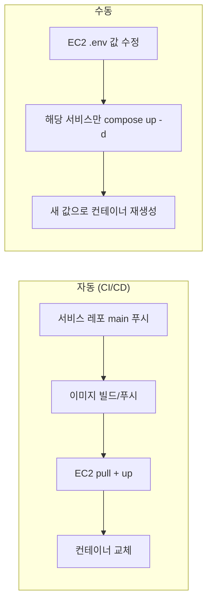
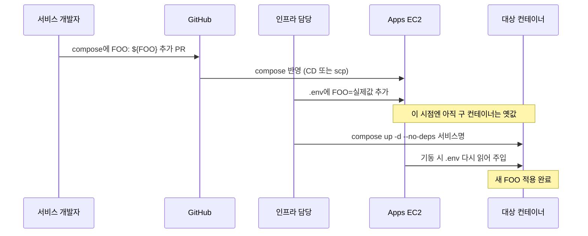
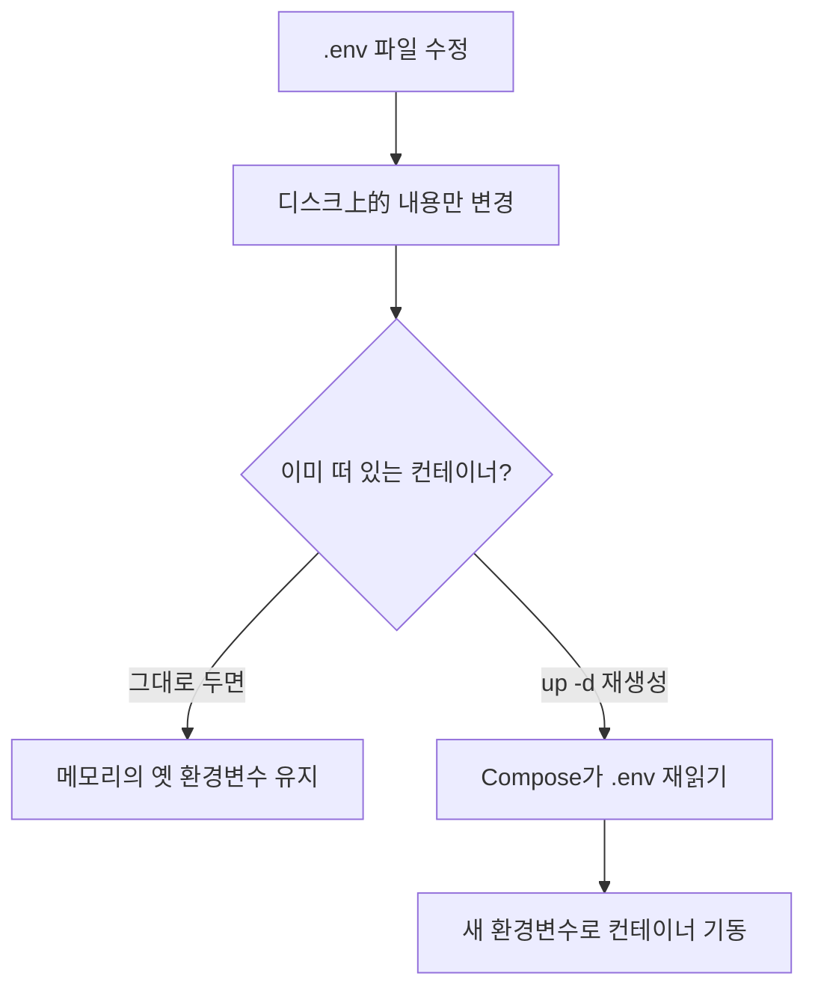

# ValueHub Prod `.env` 관리 흐름

Apps EC2의 **공통 `.env` 하나**로 런타임 환경변수를 관리한다.  
실값은 git에 올리지 않고, 컨테이너 기동 시 Compose가 주입한다.

---

## 한 줄 요약

| 구분 | 어디에 | git? | 반영 방법 |
| --- | --- | --- | --- |
| 변수 **이름** | `compose.prod-apps.yml`, `env/apps.env.example` | O | PR / CI·CD |
| 변수 **값** | EC2 `/opt/valuehub-aws-infra/.env` | X | SSH로 수동 수정 + 해당 서비스 재기동 |

---

## 전체 그림

```mermaid
flowchart TB
  subgraph Git["Git (ValueHub-AWS-Infra 등)"]
    C[compose.prod-apps.yml<br/>FOO: ${FOO}]
    E[env/apps.env.example<br/>이름만 / 예시값]
  end

  subgraph EC2["Apps EC2 /opt/valuehub-aws-infra"]
    ENV[".env<br/>FOO=실제비밀값"]
    COMPOSE[compose.prod-apps.yml]
    ENV -.->|compose up 시 읽음| COMPOSE
  end

  subgraph Containers["실행 중 컨테이너"]
    AUTH[valuehub-auth<br/>환경변수 복사본]
    GW[valuehub-gateway<br/>환경변수 복사본]
    CHAT[valuehub-chat<br/>환경변수 복사본]
  end

  C -->|CD / scp| COMPOSE
  COMPOSE -->|기동 시 주입| AUTH
  COMPOSE -->|기동 시 주입| GW
  COMPOSE -->|기동 시 주입| CHAT
```

포인트:
- `.env`는 **중앙 저장소**
- 각 컨테이너는 기동 순간에 값을 **복사해서** 가짐
- 파일만 고쳐도 이미 떠 있는 컨테이너는 안 바뀜

---

## 코드 배포 vs `.env` 변경



| 무엇을 바꿨나 | 자동? | 할 일 |
| --- | --- | --- |
| 앱 코드 | O | `main` 푸시 |
| compose에 변수 **이름** 추가 | O (Infra CD) 또는 수동 scp | compose 배포 후, 값 넣었으면 재기동 |
| `.env` **값** | X | SSH로 수정 → 해당 서비스 재기동 |

---

## 새 환경변수 추가 절차



### 명령 예시 (Apps EC2)

```bash
ssh -i .valuehub-aws-prod.pem ubuntu@54.116.150.139
cd /opt/valuehub-aws-infra

# 1) 값 수정
nano .env

# 2) 해당 서비스만 재기동 (예: auth)
IMAGE_TAG=prod docker compose -f compose.prod-apps.yml --env-file .env up -d --no-deps auth
```

Auth만 쓰는 변수면 Gateway/Chat은 안 내려도 된다.

---

## 왜 파일 수정만으로 안 되나



Docker는 컨테이너 **시작 시점**에 env를 넣는다.  
실행 중 컨테이너가 `.env` 파일을 watch 하지 않는다.

---

## 역할 분담

| 누가 | 하는 일 |
| --- | --- |
| 서비스 개발자 | 코드 + compose에 변수 **이름** 추가 |
| 인프라/배포 담당 | EC2 `.env`에 **실값** 기록, 해당 서비스 재기동 |

---

## 경로 정리

| 항목 | 경로 |
| --- | --- |
| 실값 `.env` | Apps EC2 `/opt/valuehub-aws-infra/.env` |
| compose | 동일 디렉터리 `compose.prod-apps.yml` |
| git 예시 | 레포 `env/apps.env.example` |
| git 실값 | **올리지 않음** (gitignore) |

---

## 관련 문서

- CI/CD 전체 흐름: [cicd-flow.md](./cicd-flow.md)
- AWS 셋업: [aws-setup.md](./aws-setup.md)
