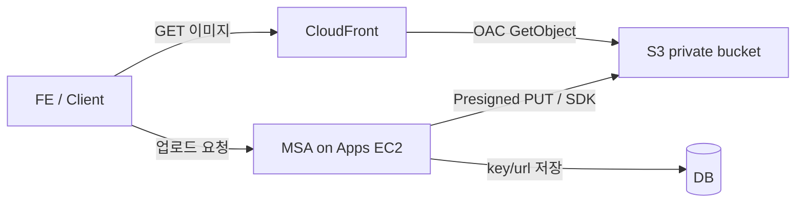

# ValueHub 미디어 — S3 + CloudFront 아키텍처 & 흐름

> 아래 값은 **예시(placeholder)** 이다. 실제 버킷명·배포 ID·도메인·키는 AWS 콘솔 또는 `secrets/media-app.env`(git 제외)를 본다.  
> **MSA API 구현(글·프로필·채팅, 5MB 제한)**: [media-api-spec.md](./media-api-spec.md)

리전 예: `ap-northeast-2` / profile 예: `valuehub`

---

## 1. 한 줄 요약

| 구성 | 역할 |
| --- | --- |
| **S3** | 사진·파일 **원본 저장** (private) |
| **CloudFront** | 사용자에게 **조회·배포** (CDN) |
| **IAM** | 업로드/삭제 권한 (Apps EC2 Role + 앱용 유저) |
| **DB** | 파일 key / CloudFront URL만 저장 |

---

## 2. 아키텍처

```text
                    ┌─────────────────┐
   FE / 브라우저 ───▶│   CloudFront    │  dxxxxxxxxxxxx.cloudfront.net
   (조회 GET)       │   Distribution  │
                    └────────┬────────┘
                             │ OAC (읽기만)
                             ▼
                    ┌─────────────────┐
                    │   S3 Bucket     │  valuehub-media-<env>-<example>
                    │   (private)     │
                    └────────▲────────┘
                             │ Put / Delete (IAM)
                    ┌────────┴────────┐
   클라이언트 ───▶  │  Apps EC2 / BE  │  Presigned URL 발급 또는 직접 PUT
   (업로드 요청)    │  + Instance Role│
                    └────────┬────────┘
                             │
                             ▼
                    ┌─────────────────┐
                    │  MySQL / Mongo  │  image_key 또는 CDN URL만
                    └─────────────────┘
```



---

## 3. 리소스 (예시 이름)

| 항목 | 예시 값 |
| --- | --- |
| S3 Bucket | `valuehub-media-<env>-<unique>` |
| S3 ARN | `arn:aws:s3:::valuehub-media-<env>-<unique>` |
| CloudFront Distribution ID | `EXXXXXXXXXXXXX` |
| CloudFront Domain | `dxxxxxxxxxxxx.cloudfront.net` |
| OAC | `EXXXXXXXXXXXXX` (`valuehub-media-oac`) |
| IAM Policy | `ValueHubMediaAppAccess` |
| IAM Role (EC2) | `valuehub-apps-ec2-role` |
| Instance Profile | `valuehub-apps-ec2-profile` → Apps EC2 `i-xxxxxxxxxxxxxxxxx` |
| IAM User (로컬/도구용) | `valuehub-media-app` |
| 실값 키 파일 (git 제외) | `secrets/media-app.env` |
| 예시 env | `env/media-app.env.example` |

S3 설정: Public Access Block 전부 ON, Versioning ON, SSE-S3, CORS(로컬/Vercel/API)

---

## 4. 흐름

### 4-1. 업로드 (Create)

```text
1. Client → BE: "이 경로에 업로드할 Presigned URL 줘"
2. BE (EC2 Role / IAM): S3 Presigned PUT 발급
3. Client → S3: PUT 파일 (CloudFront 경유 아님)
4. BE → DB: s3_key 또는 https://<cloudfront-domain>/<key> 저장
```

### 4-2. 조회 (Read)

```text
1. FE가 DB의 CloudFront URL로 
2. CloudFront 캐시 hit → 바로 응답
3. miss → S3에서 GetObject (OAC) → 캐시 후 응답
```

S3 직접 URL은 public이 아니라 **브라우저에서 막히는 것이 정상**.

### 4-3. 수정 (Update)

```text
권장: 새 key로 PUT → DB URL 갱신 → (선택) 예전 key DeleteObject
동일 key 덮어쓰기 시 CloudFront 캐시 무효화(Invalidation) 필요할 수 있음
```

### 4-4. 삭제 (Delete)

```text
1. BE → S3 DeleteObject(key)
2. BE → DB에서 key/url 제거
3. (선택) CloudFront Invalidation
```

인프라만으로 수정/삭제가 자동 실행되지는 않음. **BE API + IAM 권한**이 필요.

---

## 5. 권한 모델

| 주체 | 할 수 있는 것 |
| --- | --- |
| CloudFront (OAC) | 해당 Distribution만 S3 **GetObject** |
| Apps EC2 Instance Role | 버킷 List + Get/Put/Delete Object |
| `valuehub-media-app` 유저 | 동일 (로컬·CI·수동 테스트용 Access Key → `secrets/media-app.env`) |
| 인터넷 익명 | S3 직접 접근 **불가** / CloudFront URL로는 GET 가능 |

---

## 6. 앱에서 쓸 환경변수 예시

```bash
AWS_REGION=ap-northeast-2
S3_BUCKET=valuehub-media-<env>-<unique>
CLOUDFRONT_DOMAIN=dxxxxxxxxxxxx.cloudfront.net
CLOUDFRONT_BASE_URL=https://dxxxxxxxxxxxx.cloudfront.net
# EC2에서는 Instance Role 사용 권장 → Access Key 불필요
# 로컬만 secrets/media-app.env 의 AWS_ACCESS_KEY_ID / SECRET
```

공개 URL 규칙 예:
`https://<cloudfront-domain>/posts/{uuid}.jpg`

도메인별 prefix·5MB·Presigned API 상세는 [media-api-spec.md](./media-api-spec.md).

---

## 7. 세팅 체크리스트

- [x] Step 0: 관리 그룹에 S3 / CloudFront 권한
- [x] Step 1: S3 버킷 private + CORS + 암호화 + 버전
- [x] Step 2: CloudFront + OAC + 버킷 정책
- [x] Step 3: IAM Policy / EC2 Role·Profile / media-app 유저
- [x] Step 4: 본 문서 (흐름·아키텍처)

### 아직 안 한 것 (다음 작업)

- [x] 테스트 객체로 CloudFront URL 검증 (S3 PUT → CloudFront GET 200)
- [x] Apps EC2 실 `.env` + compose로 MSA에 `S3_BUCKET` / `CLOUDFRONT_*` 주입 (Access Key 없음, Instance Role)
- [ ] (선택) `img.<your-domain>` 커스텀 도메인 + ACM
- [ ] MSA에 Presigned 업로드 / 삭제 API 구현 → 스펙: [media-api-spec.md](./media-api-spec.md)

---

## 8. 관련 파일

| 경로 | 내용 |
| --- | --- |
| `docs/media-s3-cloudfront.md` | 세팅 진행 로그 |
| `docs/media-architecture.md` | 본 문서 (흐름·아키텍처) |
| `docs/media-api-spec.md` | 글·프로필·채팅 API / 5MB 규칙 |
| `env/media-app.env.example` | env 이름 예시 (커밋 OK) |
| `secrets/media-app.env` | 로컬 실키 (git ignore) |
| `secrets/README.md` | secrets 디렉터리 안내 |
